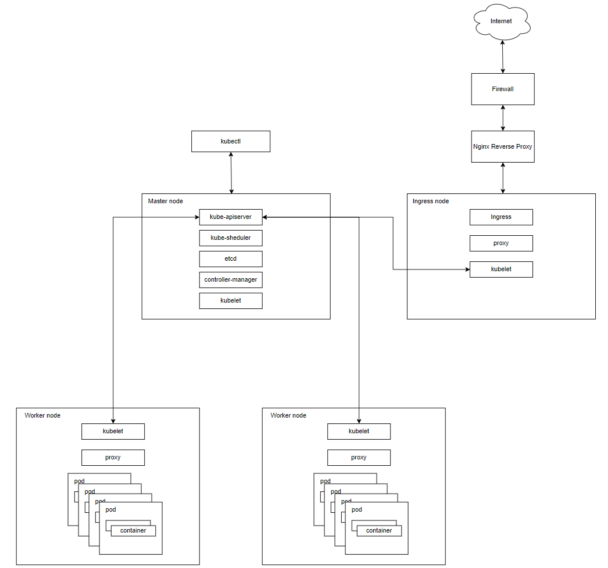
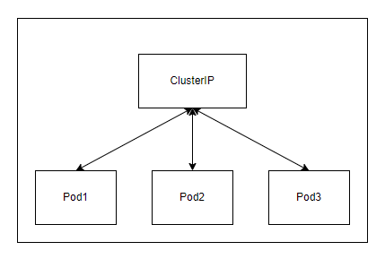
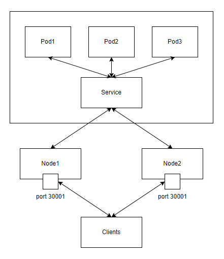
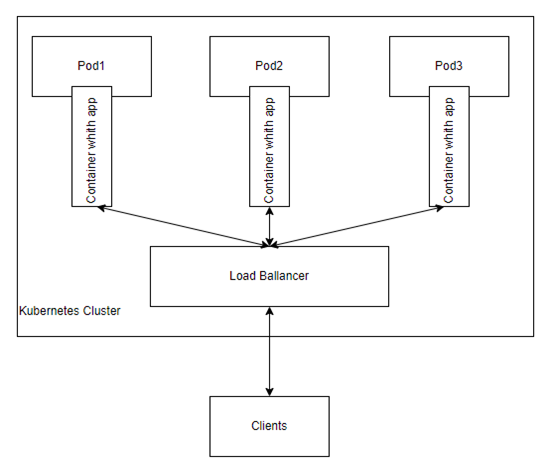
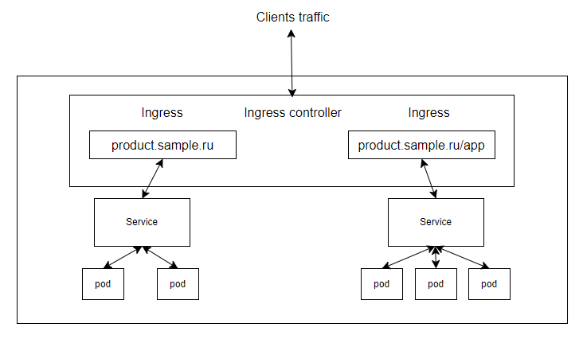
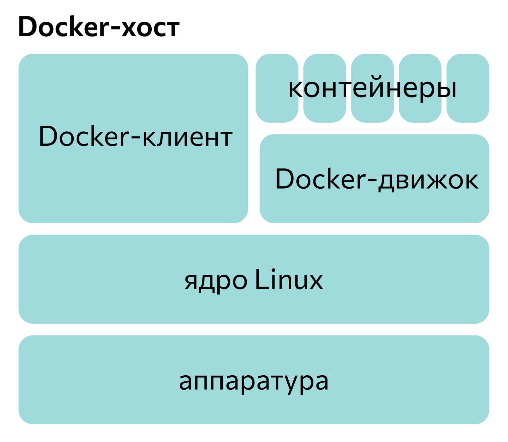
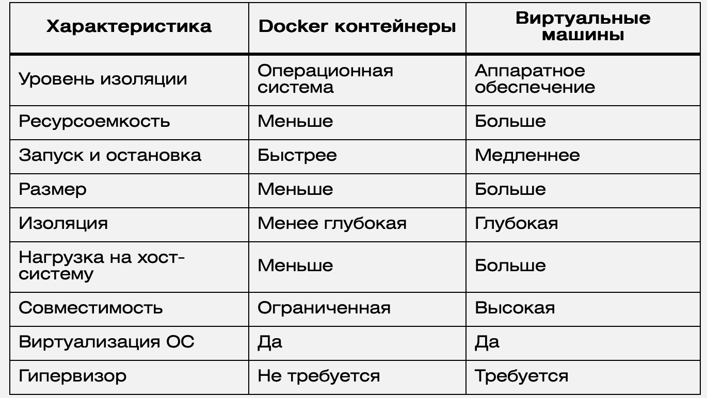

# K8s basics

## Базовая схема

## Основные термины

- Master Node (Control plane) управляет рабочими узлами и подами в кластере:
    - kube-apiserver - API-server, обеспечивающий взаимодействие с кластером к8с
    - kube-scheduler - планировщик размещеения подов на узлах кластера
    - etcd - key-value хранилище для всех данных кластера
    - contoller-manager - запускает контроллеры. Состоит из:
        - Node Controllect - обнаружение и реагирование при выходе узлов из строя
        - Job controller - следит за cron-job
        - endpoint slice - обеспечивает связь между службами и модулями
        - ServiceAccount - отвечает за аутентификацию и авторзацию приложений
        - kubelet - отвечает за управлением жизненого цикла подов
- Worker node состоит из:
    - kubelet
    - kube-proxy - простой proxy-балансировщик на каждой ноде. Отвечает за правила проксирования, фильтрацию трафика
    - Pоd - контейнер (группа контейнеров)
- Ingress Node запрещает запуск подов приложений, на ней запущен только Ingress controller
- networkpolicy - помогает ограничить трафик приложений 

- Namespace - разделение физического кластера на виртуальные. Удобный способ группировки приложений внутри кластера
- Deployment - контроллер, который управляет состоянием развертывания подов

- Service - объект, предоставляющий доступ к приложению, запущенному в виде пода/подов:
    - Разрешение DNS имен
    - Маршрутизация и балансировка трафика
    - Service discovery - ищет поды внутри кластера
    - Публикация приложений - дает доступ остальным приложениям

### Сервисы

ClusterIP - присваиват IP в сети, доступен только внутри кластера:

NodePort - предоставляет доступ к приложению по порту/портам на IP адресе:

Load Balancer - внешние балансировщики для выбора подов:

### Ingress Controller

Ingress служит для организации доступа к приложению вне кластера. Иными словами - точка входа в кластер. Ingress controller - обрабатывает трафик:

### Балансировка нагрузки

#### Round Robin
Распределяет запросы между серверами по очереди (по кругу)

Плюсы:
- Простая настройка
- Работает быстро, так как требует меньше ресурсов, чем более сложные алгаритмы
- Равные веб-узлы получаю одинаковую нагрузку

Минусы:
- Не учитывает состояние сервера в реальном времени
- Неэффективен для серверов, отличающихся по своим характеристикам. Если есть "слабое звено", то это не будет учтено

#### Weighted Round Robin
Улучшенная версия Round Robin, выдающая серверам веса приоритетов

Плюсы:
- Учитывает индивидуальные особенности серверов
- Просто настраивать

Минусы:
- Не учитывает состояние сервера в реальном времени

#### Least Connections

Мониторит количество активных соединений на каждом сервер и направляет запрос на ту машину, которая "свободная". Используется в приложениях, работа которых зависит от числа активных соединений. В системах с длинными http-сессиями, видеосервисы и БД.

Плюсы:
- Балансирует загрузку с учетом изменений в режиме онлайн

Минусы:
- Нужно организовывать синхронизацию показателей серверов и балансировщика
- Более сложная настройка, при некорректности может возникнуть дисбаланс

#### Методы с хешированием

Хешируем IP - адресс или запрос, в зависимости от этго выбираем сервер

Плюсы:
- Устанавливает связь между источником запроса и конкретным сервером
- Отлично подходит, когда нужно сохранять пользовательские сессии между запросами

Минусы:
- Не учитывает объем запросов и перегрузки
- Нет гибкости. Если машин станет больше или меньше, хеширование не сможет автоматичеси изменить распределение запросов

#### Sticky Sessions

Sticky Session или Session Persistence - привязывает пользователя к конкретному серверу на время всей сессии. Через cookie, либо анализ сессии

Плюсы:
- Запросы обрабатываются одним и тем же сервером - ускоряем ответ

Минусы:
- Высокий риск перегрузки

#### Service Mesh

- Гарантирует доставку трафика до приложений:
    - реализует retry / timeouts / circuit breaker
- Шифрует трафик, верифицирует на основе сертификатов
- Tracing запросов
- Реализует переключение трафика при canary, a/b

Недостатки:
Избыточная сложность, накладные расходы

#### Docker

Основная схема:

Особенность:

Контейнеры и виртуальные машины (ВМ) — это методы изоляции приложений и окружений. Docker использует виртуализацию на уровне операционной системы, позволяя запускать приложения в изолированных контейнерах, которые делят ядро ОС с хост-системой. ВМ, напротив, создают полные виртуальные компьютеры с отдельными ОС и ресурсами.

##### Исходники:

- <a href="https://habr.com/ru/articles/803717/">Статья на хабре про kubernetes</a>
- <a href="https://habr.com/ru/companies/ruvds/articles/732648/">[Habr] Балансировщик нагрузки</a>
- <a href="https://edgecenter.ru/blog/shto-takoye-balansirovshchik-nagruzki">Балансировщик нагрузки</a>
- <a href="https://tproger.ru/articles/kubernetes--wpargalka-dlya-sobesedovaniya--chast-2">Service mesh</a>
- <a href="https://habr.com/ru/articles/709268/">[Habr] Docker</a>
- <a href="https://blog.skillfactory.ru/glossary/docker/">Docker</a>